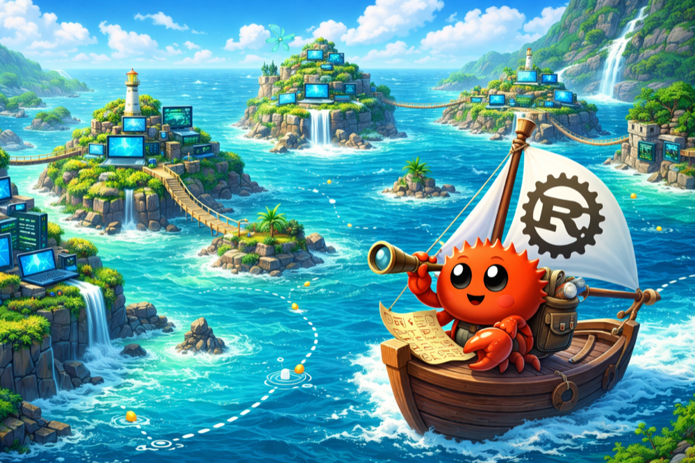
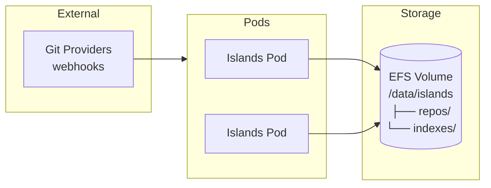
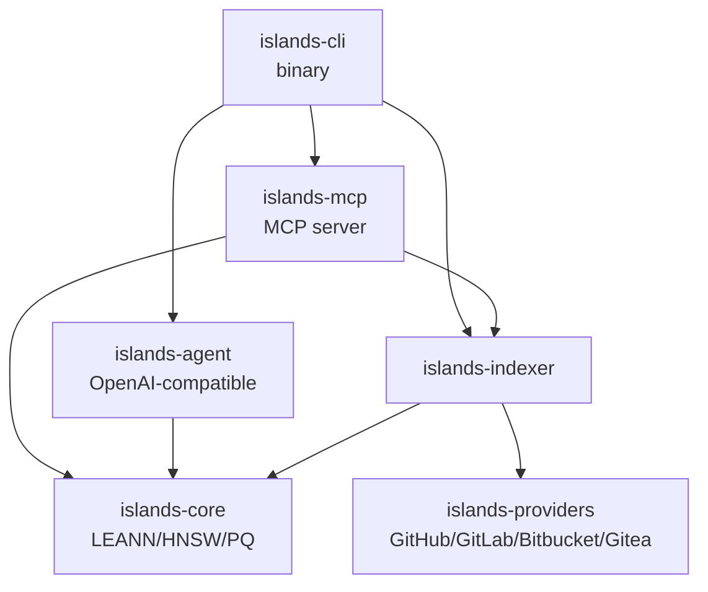

<div align="center">

# Islands



[](https://github.com/panbanda/islands/actions/workflows/rust.yaml)
[](https://crates.io/crates/islands-cli)
[](https://www.rust-lang.org/)
[](https://opensource.org/licenses/MIT)

**Your codebases were isolated, scattered, unknowable islands. Welcome to the vibrant, interconnected archipelago.**

Islands implements the [LEANN algorithm](https://arxiv.org/abs/2506.08276) to index and search across codebases with ~95% storage reduction. Store the map, not the territory. Recompute what you need, when you need it.

**Why "Islands"?** Every codebase is an island - isolated, self-contained, surrounded by the vast ocean of everything else you've forgotten. Need to find that authentication pattern from three projects ago? Good luck sailing through git histories and grep results. Islands builds bridges between your codebases without requiring you to store massive embedding vectors everywhere. The LEANN algorithm stores only the graph structure (the map of which code relates to which) and recomputes embeddings on-demand during search. Your codebases stay on their islands; `islands` just knows how to navigate between them.

</div>

---

## Features

<details>
<summary><strong>LEANN Vector Search</strong> - Store the graph, not the embeddings</summary>

Traditional vector search stores full embeddings for every chunk of code - typically 768 to 4096 floats per chunk. For a large codebase, this means gigabytes of storage just for the index.

LEANN (Low-storage Embedding-based Approximate Nearest Neighbor) takes a different approach:

- **Graph-only storage**: Store the proximity graph in CSR format, not the embeddings
- **On-demand recomputation**: Compute embeddings only for nodes actually visited during search
- **Storage scales with edges**: $O(n \cdot M)$ instead of $O(n \cdot d)$ where $M \approx 30$ and $d \approx 768\text{--}4096$

For typical embedding dimensions, this yields **~25x storage reduction**.

**Parameters from the paper (Section 5):**
- $M = 30$ connections per node
- $\text{efConstruction} = 128$
- High-degree preserving pruning: hub nodes (top 2%) retain more connections

**Why it matters:** [Wang et al. (2025)](https://arxiv.org/abs/2506.08276) demonstrated that for retrieval-augmented generation workloads, you don't need to store embeddings permanently. The cost of recomputing a few embeddings during search is negligible compared to the storage savings. This makes it practical to index many codebases without requiring massive storage infrastructure.

> [!TIP]
> Use LEANN when indexing multiple repositories or when storage is constrained. The search latency penalty is minimal for typical query workloads.

</details>

<details>
<summary><strong>Multi-Provider Git Integration</strong> - One interface, any git host</summary>

Islands supports repositories from multiple git providers through a unified interface:

| Provider | URL Formats |
|----------|-------------|
| GitHub | `github.com/owner/repo`, `git@github.com:owner/repo.git` |
| GitLab | `gitlab.com/owner/repo`, `git@gitlab.com:owner/repo.git` |
| Bitbucket | `bitbucket.org/owner/repo` |
| Gitea | Any self-hosted Gitea instance |

Each provider implements the same async trait, handling:
- Repository cloning and updates
- Branch and tag enumeration
- File content retrieval
- Webhook integration for automatic sync

**Why it matters:** Your code doesn't live in one place. Some projects are on GitHub, others on GitLab, maybe some on a self-hosted Gitea instance. Islands doesn't care - add any repository by URL and search across all of them uniformly.

> [!TIP]
> Set provider tokens via environment variables (`GITHUB_TOKEN`, `GITLAB_TOKEN`) to access private repositories.

</details>

<details>
<summary><strong>MCP Server</strong> - AI assistant integration via Model Context Protocol</summary>

Islands includes a Model Context Protocol (MCP) server that exposes semantic search to AI assistants like Claude. This enables natural language queries across your indexed codebases.

**Available tools:**

| Tool | Description |
|------|-------------|
| `islands_list` | List all indexed codebases |
| `islands_search` | Semantic search across codebases |
| `islands_add_repo` | Add and index a repository by URL |
| `islands_sync` | Sync and re-index a repository |
| `islands_status` | Get index status and statistics |

**Example queries once configured:**

- "Find authentication middleware implementations"
- "Show me how error handling is done in the payment service"
- "Find examples of database connection pooling"

**Why it matters:** AI assistants work best when they can access relevant code context. MCP is the emerging standard for tool integration, and Islands provides semantic search as a first-class MCP tool. Instead of copying code into prompts, the assistant can search your indexed codebases directly.

> [!TIP]
> Configure Islands as an MCP server in Claude Code with `claude mcp add islands-server -- islands-mcp`

</details>

<details>
<summary><strong>Interactive Agent</strong> - Q&A sessions via OpenAI-compatible APIs</summary>

Islands includes an agent for interactive exploration of your codebases, compatible with any OpenAI SDK-supported API (OpenAI, Azure OpenAI, local models, etc.). The agent uses function calling to search, retrieve, and explain code.

```bash
# Start an interactive session
islands ask

# The agent can:
# - Search across all indexed codebases
# - Explain code patterns and implementations
# - Compare approaches across different projects
# - Answer questions about your codebase architecture
```

**Configuration:**

```yaml
agent:
  model: gpt-4o
  temperature: 0.1
  max_tokens: 4096
```

**Why it matters:** Sometimes you need a conversation, not just search results. The agent maintains context across questions, can follow up on previous answers, and explains code in natural language. It's particularly useful for onboarding to unfamiliar codebases or exploring architectural patterns.

> [!TIP]
> Set `ISLANDS_OPENAI_API_KEY` to enable the agent. Lower temperature (0.1) produces more focused, deterministic responses.

</details>

<details>
<summary><strong>Kubernetes Native</strong> - EFS storage with automatic sync</summary>

Islands is designed for deployment on Kubernetes with shared storage:

- **EFS/NFS support**: Indexes stored on shared filesystem accessible by all pods
- **Automatic sync**: Configurable interval for pulling updates from repositories
- **Webhook integration**: Real-time sync on push events
- **Horizontal scaling**: Multiple instances can serve search requests

**Deployment architecture:**



**Why it matters:** Running Islands as a service means your AI assistants always have access to up-to-date code context. The shared storage model ensures consistency across replicas, and webhooks keep indexes fresh without polling.

> [!TIP]
> Use `kubectl apply -k k8s/` to deploy. Configure webhooks in your git providers pointing to the Ingress endpoint.

</details>

## Installation

### Homebrew (macOS/Linux)

```bash
brew tap panbanda/islands
brew install islands
```

### Cargo

```bash
cargo install islands-cli
```

### Build from Source

```bash
git clone https://github.com/panbanda/islands.git
cd islands
cargo build --release
```

## Quick Start

```bash
# Add a repository by URL
islands add https://github.com/owner/repo --token $GITHUB_TOKEN

# Search across indexed codebases
islands search "authentication middleware"

# List all indexes
islands list

# Start the MCP server for AI assistant integration
islands serve

# Interactive Q&A session (requires OpenAI-compatible API)
islands ask
```

## Configuration

Islands is configured through environment variables or a config file (`islands.yaml`).

### Environment Variables

| Variable | Description | Default |
|----------|-------------|---------|
| `ISLANDS_DEBUG` | Enable debug mode | `false` |
| `ISLANDS_LOG_LEVEL` | Log level (DEBUG, INFO, WARN, ERROR) | `INFO` |
| `ISLANDS_OPENAI_API_KEY` | OpenAI API key for agent | - |
| `ISLANDS_SYNC_INTERVAL` | Sync interval in seconds | `300` |
| `ISLANDS_STORAGE__BASE_PATH` | Base storage path | `/data/islands` |

### Config File

```yaml
debug: false
log_level: INFO
sync_interval: 300

storage:
  base_path: /data/islands
  repos_path: /data/islands/repos
  indexes_path: /data/islands/indexes

leann:
  backend: hnsw
  no_recompute: true

providers:
  - type: github
    token: ${GITHUB_TOKEN}
  - type: gitlab
    token: ${GITLAB_TOKEN}

agent:
  model: gpt-4o
  temperature: 0.1
```

## MCP Integration

### Claude Code

```bash
claude mcp add islands-server -- islands-mcp
```

### Claude Desktop

Add to `~/Library/Application Support/Claude/claude_desktop_config.json`:

```json
{
  "mcpServers": {
    "islands": {
      "command": "islands-mcp"
    }
  }
}
```

## Architecture

Islands is a Rust workspace implementing LEANN for low-storage vector search:



### Crates

| Crate | Description |
|-------|-------------|
| `islands-core` | LEANN vector indexing, HNSW, PQ, distance metrics |
| `islands-providers` | Git provider implementations (GitHub, GitLab, Bitbucket, Gitea) |
| `islands-indexer` | Code chunking, embedding generation, file watching |
| `islands-mcp` | MCP server for AI assistant integration |
| `islands-agent` | Interactive agent for Q&A (OpenAI-compatible) |
| `islands-cli` | Command-line interface |

### Core Algorithms

- **leann.rs**: `LeannIndex` with `CsrGraph` for graph-only storage, `EmbeddingProvider` trait for on-demand recomputation
- **hnsw.rs**: Traditional HNSW implementation for comparison
- **pq.rs**: Product Quantization for vector compression
- **distance.rs**: Cosine, Euclidean, dot product metrics
- **search.rs**: Two-level search with approximate/exact distance queues

## Development

```bash
# Run all tests
cargo test --workspace

# Run tests for a specific crate
cargo test -p islands-core

# Format and lint
cargo fmt
cargo clippy --all-targets -- -D warnings

# Build documentation
cargo doc --no-deps

# Run benchmarks
cargo bench -p islands-core
```

## Docker

```bash
# Build the image
docker build -t islands -f docker/Dockerfile .

# Run with docker-compose
docker-compose -f docker/docker-compose.yml up
```

## Kubernetes

```bash
# Deploy to Kubernetes
kubectl apply -k k8s/

# Create secrets
kubectl create namespace islands
kubectl create secret generic islands-secrets \
  --from-literal=ISLANDS_OPENAI_API_KEY=$OPENAI_API_KEY \
  --from-literal=ISLANDS_PROVIDERS__0__TOKEN=$GITHUB_TOKEN \
  -n islands
```

## Contributing

1. Fork the repository
2. Create your feature branch (`git checkout -b feature/amazing-feature`)
3. Commit your changes (`git commit -m 'feat: add amazing feature'`)
4. Push to the branch (`git push origin feature/amazing-feature`)
5. Create a Pull Request

## References

- **LEANN Paper**: Wang et al., "LEANN: A Low-Storage Embedding-based Retrieval System for Large Scale Generative AI Applications" ([arXiv:2506.08276](https://arxiv.org/abs/2506.08276))
- **LEANN Implementation**: [github.com/yichuan-w/LEANN](https://github.com/yichuan-w/LEANN)
- **MCP Specification**: [modelcontextprotocol.io](https://modelcontextprotocol.io/)

## License

MIT License - see [LICENSE](LICENSE) for details.
